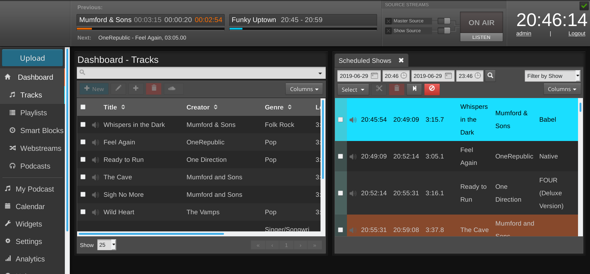
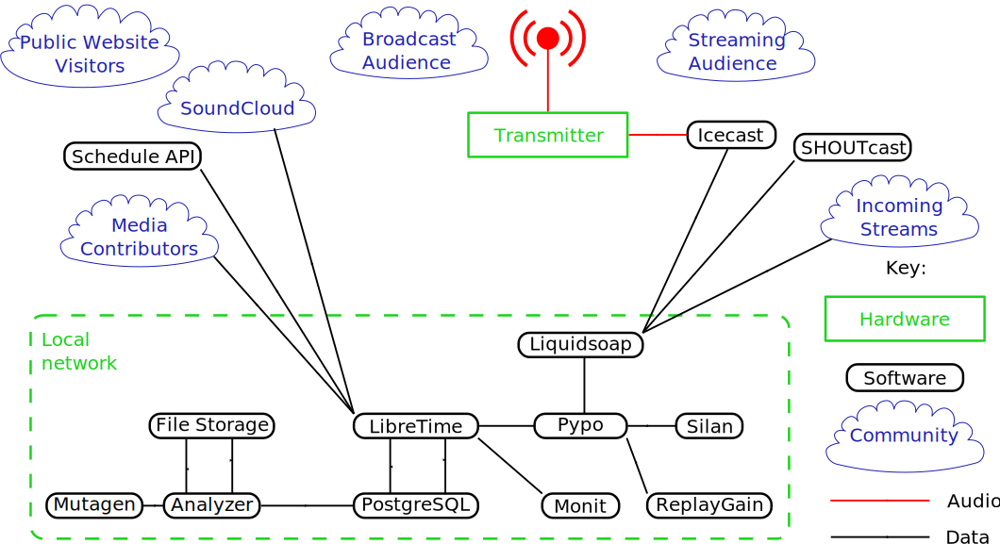

# What is LibreTime?

[LibreTime](http://libretime.org/ "LibreTime homepage") is the open broadcast
software for scheduling and remote station management. Web browser access to
the station's media library, multi-file upload and automatic metadata import
features are coupled with a collaborative online scheduling calendar and
playlist management. The scheduling calendar is managed through an easy-to-use
interface and triggers playout with sub-second precision.

LibreTime is intended to provide a solution for a wide range of broadcast
projects, from community to public and commercial stations. The scalability of
LibreTime allows implementation in a number of scenarios, ranging from an
unmanned broadcast unit accessed remotely through the Internet, to a local
network of machines accessing a central LibreTime storage system. LibreTime
supports the playout of lossy compressed audio files in both MP3 and AAC
formats and the open, royalty-free equivalent
[Ogg Vorbis](http://www.vorbis.com/ "Ogg Vorbis homepage"). It also supports
playout of lossless FLAC and WAV format audio files.

LibreTime manages the [Liquidsoap](http://savonet.sourceforge.net/) stream
generator at the heart of the system. Liquidsoap generates streams from files
in the LibreTime library and any remote input streams that you specify.
Available stream output formats include Ogg Vorbis, Ogg Opus, MP3, and AAC. The
library is indexed in a [PostgreSQL](http://www.postgresql.org/) database to
enable searching. Live shows can be recorded automatically with
[Ecasound](http://eca.cx/ecasound/ "Ecasound homepage"), using the sound card
line input. News editors, DJs and station controllers can use LibreTime to
build playlists or smart blocks and manage media files (upload, edit metadata,
manage advertisements) at the station or via the Internet.

The scheduler in LibreTime has a calendar view, organized by months, weeks or
days. Program editors can schedule playlists and shows here for their
broadcast station. In some scenarios, the transmitter is situated outside the
reach of the broadcaster and all program management has to be maintained
through the web interface. Possible reasons for this scenario might be of a
pragmatic nature (running many stations from one central office due to limited
human resources) or an emergency (running a transmitter in a crisis area
without putting staff at risk).

LibreTime services
----------------

| Service | Description |
|---------|-------------|
| `airtime-analyzer` | Keeps track of files being added, renamed, moved or removed from storage, and reads their metadata using the Mutagen library. |
| [PostgreSQL](https://www.postgresql.org/) | Contains the location of those media files and their metadata. This means you can search for and playlist a set of media files according to the specific metadata that you require, or use a 'smart block' to select the files for you. The database also contains details of specified remote input streams. |
| Pypo | (Python Playout engine) Downloads media from the storage up to 24 hours ahead of playout and checks it for average level (with ReplayGain tools) and leading or trailing silence (with Silan). At playout time, the media to be broadcast is sent to Liquidsoap. |
| [Liquidsoap](https://www.liquidsoap.info/) | Takes individual media files and remote input streams, and assembles them into a continuous output stream. This stream can be sent to a sound card (e.g. for a broadcast mixer, on the way to an FM or DAB transmitter) or to a streaming server for IP network distribution, over the LAN, local WiFi or the Internet. You can stream to a sound card and up to three different stream distribution servers with the same LibreTime server, if you wish. |
| [Icecast](https://www.icecast.org/) or [Shoutcast](https://shoutcast.com/) | Audio streaming server, used for creating an internet radio stream from LibreTime. Icecast is included in the LibreTime installation by default. Note: If a suitable Liquidsoap output is not available for your streaming service of choice, you can send audio from Liquidsoap to a separate encoding or streaming machine via a sound card or relay stream. |
| [Monit](https://mmonit.com/monit/) | Monitors the health of pypo, airtime-analyzer and Liquidsoap, and reports the status of these services to LibreTime. |
| [RabbitMQ](https://www.rabbitmq.com/) | Pushes messages from LibreTime to media-monitor and pypo about changes to media files and the playout schedule. |

Example studio broadcast system
-------------------------------

In the diagram of an FM radio station below, LibreTime is hosted on a server
connected to the local network, with direct soundcard access. Liquidsoap
outputs streams to both the transmitter, via the main studio mixer, and
streaming media servers. The machine running LibreTime is behind a firewall
because it is also connected to the Internet for remote access by media
contributors. This enables LibreTime to offer password-protected access to the
media library and scheduling from both inside and outside the studio building.

Example web broadcast system
----------------------------

In the diagram below, LibreTime is hosted on a remote web server, and has no
soundcard. There does not need to be a centralised studio, although LibreTime
can enable remote studios to stream in to Liquidsoap at authorised times.
Optionally, the outgoing Icecast stream can be relayed to a transmitter.

