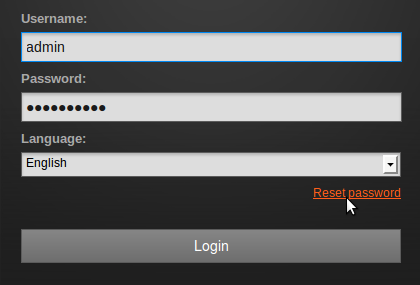
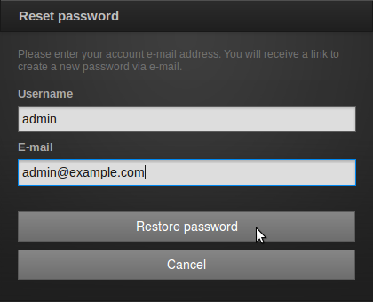

If the server is only being used for LibreTime and has a web browser installed, you can access the administration interface 
directly on that server by opening the address:

    http://localhost/

If you have set up LibreTime so that it can be accessed from other computers, you would use a domain name instead. For 
example:

    https://libretime.example.com/

You can log in for the first time with the user name *admin* and the password set during installation. Your browser should 
automatically focus on the **Username** field.

If you enter the password incorrectly three times, you will be presented with a reCAPTCHA challenge to prove that you are 
a human, and not a password-guessing robot. This feature helps protect your LibreTime installation against brute force 
attacks.

If activated, you will see a link **Reset password** below the password field, which enables users to obtain a password 
reminder by email. See the chapter *Preferences* for configuration details.

 

The **E-mail** address you enter must match the address stored in the database for your **Username**.

The Master Panel
----------------

After the pop-up window is closed, you should now see the **Master Panel**, which is present at the top of every page of
the LibreTime interface. On the left hand side, the Master Panel displays the details of the **Previous** file played out, 
the current file playing (with an orange progress bar and time elapsed/time remaining), and the details of the **Next** 
file due to play. It also displays the name and scheduled time of the current show, with a blue progress bar.

Beneath this side of the Master Panel is the main navigation menu, with sub-menus labelled **Now Playing**, **Add Media**, 
**Library**, **Calendar**, **System**, **History** and **Help**. We'll be looking at the contents of these menus in the 
following chapters of this book.

On the right hand side of the Master Panel are the switches for the **Source Streams**, which enable you to switch from 
scheduled play to remote live sources, and back. (See the chapter *Stream settings* for details of this feature). The 
**On Air** indicator turns from dark grey to red whenever audio is being played out. Underneath this indicator is a
**Listen** button, which opens a pop-up player that can be used to audition the available playout streams.

There is also a clock indicating the **Station time** and time zone. Beneath the clock and just to the left, the name of 
the user currently logged in is displayed, and there is the link for you to **Logout**. 

Clicking the username link opens a page in which you can update your LibreTime password, contact details, language and time
zone preferences. Click the **Save** button once you have made the changes that you require.

On the right of the Logout link, clicking the green check mark opens a pop-up window with information about the version of 
LibreTime installed. If your LibreTime installation is not the latest version available, the green check mark changes to a 
green upgrade arrow. Should your LibreTime installation get too far out of date, this arrow will change to a red exclamation
mark.

Checking an Icecast server
--------------------------

If you have installed an Icecast streaming media server, you can check that Icecast is running by opening its default server
port of 8000 in your web browser. For example, on the server itself, you can use:

    http://localhost:8000

or from another machine, using the domain name of the Icecast server:

    http://streaming.example.com:8000

You should see the Icecast status page, with details of any connections that your LibreTime server has made to this Icecast 
server. If you have only just installed LibreTime, there may not be any media playing out yet.

