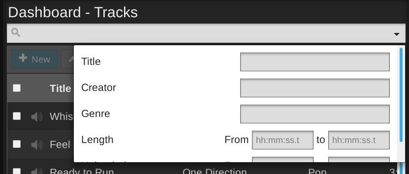
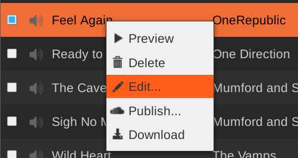

# Tracks

This page of the Libretime interface enables you to search the media library,
sort and display the search results by the criteria that you choose, audition
library items, and drag and drop those items into a playlist. You can also
adjust fade and cue points, create smart blocks (automatically generated
playlists), or add incoming web streams to the library. The **Library** page
is not visible to *Guest* users.

Searching the library
---------------------

In the library table which opens, the upper section is for the **Advanced
Search Options**, which enable you to search within individual fields of the
database such as **Title** or **Creator**. Like an Internet search engine, you
do not have to type in the correct upper or lower case, press the **Enter** key,
or even type the whole of the search term before matches from the Libretime
library are displayed.

At the bottom of the library table, click the **First**, **Previous**, **Next**,
**Last** or individual page number buttons to browse the search results.
Right-clicking an item in the search results will display the available options
for that item in a pop-up window.

The columns displayed in the search results correspond to the fields available
for advanced searches (except for **Scheduled** and **Playlist / Block**, which
indicate if a particular item is in use). To change the fields which can be
searched, click the **Show / hide columns** button on the right side of the
table, just above the search results.

Click the metadata column headings such as **Title**, **Creator**, **Album**, or
**Genre** to sort the entries in ascending or descending order. In the second
column, audio files are represented by a loudspeaker icon, while playlists ares
represented by a document icon. Smart blocks have a think bubble icon, and web
streams have an arrow icon.

To find all files uploaded by yourself, or another specific member of the
station staff, click the **Show / hide columns** checkbox which enables the
**Owner** column. After you have made your search, you can click the header of
the **Uploaded** column to find the items that person added to the server most
recently.

Advanced search terms are matched using 'and' rather than 'or' logic, to narrow
your search. Perhaps you have tagged some jazz-flavoured station idents intended
for use in a particular show called 'Jazz Maverick' with the **Album** tag of
*Jazz Maverick* and a **Genre** of *Ident*. You could then find exactly the
idents you are searching for by typing *maverick* and *ident* into the
respective advanced search fields.

If your jingles are tagged with *Jingle* in the **Genre** or other fields, you
can very easily find them by entering *jingle* into the search field. The same
technique can be used to find advertising and promotional files. (See the
chapter *Preparing media for ingest* for tips on batch tagging files with
metadata). Unlike advanced searches, simple searches use 'or' logic for
multiple search terms, so a simple search for *jingle ident* will return items
matching either keyword.

Clicking on an item in the library table opens a pop-up menu which enables you
to audition the item, or remove it from the Libretime library. Media types which
cannot be auditioned directly in a web browser, such as FLAC, have a lock icon
instead of a loudspeaker icon, but these files can be downloaded to your local
computer for audition instead. The **Delete** option should be used with
caution, because this action cannot be undone. For media files, you can also
**Edit Metadata** stored for the file using this menu.

