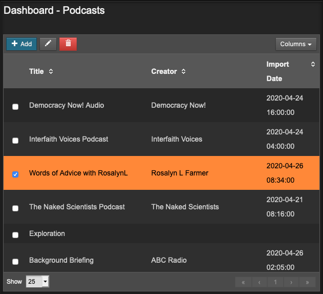

> Quick Links:
- [Podcasts](#podcasts)
- [Webstreams](#webstreams)

<html>
<iframe width="560" height="315" src="https://www.youtube-nocookie.com/embed/g-4UcD8qvR8" frameborder="0" allow="accelerometer; autoplay; encrypted-media; gyroscope; picture-in-picture" allowfullscreen></iframe>
</html>

# Podcasts   {#podcasts}

The Podcasts page allows you add subscriptions to podcasts which are often used to syndicated audio files using a URL called a RSS feed. This allows your LibreTime instance to automatically download new shows from the web.

In order to add a podcast you need to get the RSS feed. All podcasts available on iTunes have a RSS feed but it is sometimes hidden. See this issue on our github page [#510](https://github.com/LibreTime/libretime/issues/510) for more information. RSS feeds that do not end in *.xml* may be accepted by LibreTime but might fail to download episodes; in that case, download the episode using a podcast client such as [gpodder](https://gpodder.github.io/) and then manually upload and schedule the episode. Podcast feeds coming from Anchor.fm have been known to have this issue.

The podcast interfaces provides you with the ability to generate [Smartblocks](smartblocks) that can be used in conjunction with [Autoloading Playlists](../calendar/#autoloading-playlist) to schedule the newest episode of a podcast without human intervention.

Video Tutorials:
- [How to schedule a podcast to play the latest episode automatically](https://www.youtube.com/watch?v=g-4UcD8qvR8)

## Podcasts Dashboard

The podcasts dashboard is similar to the tracks view, allowing you to add, edit, and remove
podcasts by the toolbar, in addition to sorting by columns.

To add a podcast, click on the **+ Add** button on the toolbar and provide the podcast's RSS feed, which usually ends in *.xml*.
Once the podcast's feed is recognized, the editor pane opens for the podcast.

### Editor

In the podcasts editor, you can rename the podcast, update settings for the podcast, and manage episodes.
A search box is available to search for episodes within the feed.

- To import an episode directly into LibreTime, double-click on an episode or select it and click **+ Import**. The podcast will appear under tracks with the Podcast Name as the Album.
- To delete an episode from LibreTime, select the episode and click on the red trash can on the toolbar.
- If you would like LibreTime to automatically download the latest episodes of a podcast, make sure *Download latest episodes* is checked. This can be used in conjunction with Smartblocks and Playlists to automate downloading and scheduling shows that are received via podcast feed.

# Webstreams   {#webstreams}

<html>
<iframe width="560" height="315" src="https://www.youtube-nocookie.com/embed/Ha3X6aYdY04" frameborder="0" allow="accelerometer; autoplay; encrypted-media; gyroscope; picture-in-picture" allowfullscreen></iframe>
</html>

## Adding a webstream
A web stream URL and metadata can be added to the LibreTime library, so that a remote stream can be searched for and scheduled to be *pulled* into a show. For example, at the top of the hour your station may pull a news report from journalists working in another studio. This is a different concept from **Master Source** and **Show Source** remote streams which are *pushed* into the LibreTime playout schedule.

To add a web stream, click the **+ New** button on the left side of the Webstreams page. Like a playlist, web streams in the Library can have a title and **Description**, which may help you find them in searches later.

The **Stream URL** setting must include the *port number* (such as 8000) and *mount point* (such as remote\_stream) of the remote stream, in addition to the streaming server name. A **Default Length** for the remote stream can also be set. If the stream is added at the end of a show which becomes overbooked as a result, it will be faded out when the show ends.

Note: LibreTime checks the remote webstream's status upon editing stream settings, so an offline stream will result in an error. There are many tools such as [BUTT](https://danielnoethen.de/butt/) and [MIXXX](https://www.mixxx.org) that can be used to send a test stream to LibreTime can save it; read more [here](../live-shows-with-mixxx/index.md).
