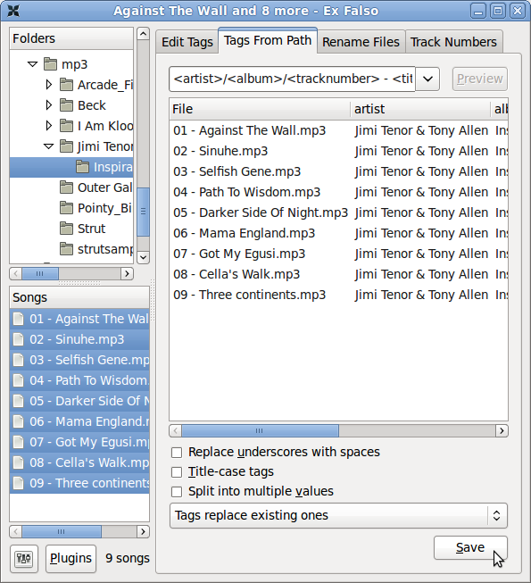
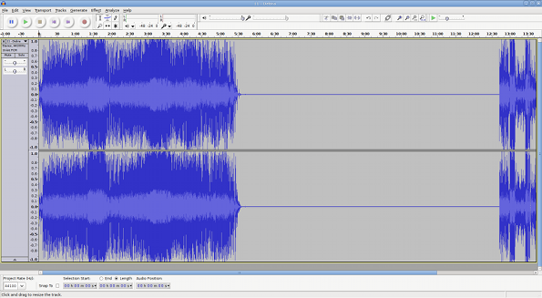

Metadata quality
----------------

LibreTime automatically imports any metadata that is in the files' ID3 tags. If these tags are incorrect or are missing information, you will have to either edit the metadata manually, or suffer the consequences. For example, if the files have creator or genre metadata missing, it will be impossible to search for, create playlists or generate smart blocks according to these criteria until you add it.

There are a number of programs available which can be used to correct mistakes or incomplete information in ID3 tags. On GNU/Linux, the program **Ex Falso** ([http://code.google.com/p/quodlibet/](http://code.google.com/p/quodlibet/) "http://sourceforge.net/projects/dr14tmeter/")) can be useful for batch setting and editing ID3 tags before importing files into your LibreTime server. On a Debian or Ubuntu desktop machine, you can install this program with the command:

    sudo apt-get install exfalso

After installation, you can run this program with the command:

    exfalso

or from the desktop menu. The *Tags From Path* feature of this program is a particularly useful time saver if you have a large archive of untagged files. Sometimes there is useful creator or title information in the file name or directory path structure, which can be converted into an ID3 tag automatically.

Metadata in legacy character sets
---------------------------------

LibreTime expects file tag metadata to be stored in the international *UTF-8* character set. Programs such as **Ex Falso** (described above) encode metadata in UTF-8 by default. If you have an archive of files encoded with metadata in a legacy character set, such as the Cyrillic encoding *Windows-1251*, you should convert these files before import.

The program **mid3iconv** (part of the **python-mutagen** package in Debian and Ubuntu) can be used to batch convert the metadata character set of files on the command line. You can install **python-mutagen** with the command:

    sudo apt-get install python-mutagen

 For example, to preview the conversion of tags from Windows-1251 (CP1251) character set to UTF-8 for a whole archive of MP3 files, you could use the command: 

    find . -name "*.mp3" -print0 | xargs -0 mid3iconv -e CP1251 -d -p

in the base directory of the archive. The **-d** option specifies that the new tag should be printed to the server console (debug mode), and the **-p** option specifies a preview run. This preview will enable you to confirm that the metadata is being read and converted correctly before writing the new tags.

To actually convert all of the tags and strip any legacy ID3v1 tag present from each file at the same time, you could use the command:

    find . -name "*.mp3" -print0 | xargs -0 mid3iconv -e CP1251 --remove-v1

The name of the original character set follows the **-e** option. Other legacy character sets that mid3iconv can convert to UTF-8 include:

KOI8-R: Russian
KOI8-U: Ukrainian

GBK: Traditional Chinese
GB2312: Simplified Chinese

EUC-KR: Korean
EUC-JP: Japanese

CP1253: Greek
CP1254: Turkish
CP1255: Hebrew
CP1256: Arabic

Audio loudness
--------------

On file ingest, LibreTime analyzes each Ogg Vorbis, MP3, AAC or FLAC file's loudness, and stores a *ReplayGain* value for that file in its database. At playout time, the ReplayGain value is provided to Liquidsoap so that gain can be automatically adjusted to provide an average output of -14 dBFS loudness (14 decibels below full scale). See <http://www.replaygain.org/> for more details of ReplayGain.

Because of this automatic gain adjustment, any files with average loudness higher than -14 dBFS will not sound louder than quieter files at playout time, but the lower crest factor in the louder files (their relatively low peak-to-average ratio) may be apparent in the output, making those files sound less dynamic. This may be an issue for contemporary popular music, which can average at -9 dBFS or louder before ReplayGain adjustment. (See <http://www.soundonsound.com/sos/sep11/articles/loudness.htm> for a detailed analysis of the problem).

Your station's producers should therefore aim for 14dB between peak and average loudness to maintain the crest factor of their prepared material (also known as *DR14* on some dynamic range meters, such as the command-line DR14 T.meter available from <http://sourceforge.net/projects/dr14tmeter/>). If the producers are working to a different loudness standard, the ReplayGain modifier in LibreTime's Stream Settings page can be adjusted to suit their material.

Large transient peaks in otherwise quiet files should be avoided, to guard against the need for peak limiting when ReplayGain is applied to those quieter files.

The **vorbisgain** command-line tool, available in the **vorbisgain** package in Debian/Ubuntu, can be used to indicate the ReplayGain of an individual Ogg Vorbis file before ingest into LibreTime. (A similar tool for MP3 files is available in the **mp3gain** package in Debian/Ubuntu).

Here is an example of a very quiet file where the use of ReplayGain would make the output more than 17dB louder:

    $ vorbisgain -d Peter_Lawson-Three_Gymn.ogg
    Analyzing files...

       Gain   | Peak | Scale | New Peak | Track
    ----------+------+-------+----------+------
    +17.39 dB | 4536 |  7.40 |    33585 | Peter_Lawson-Three_Gymn.ogg

And here is an example of a very loud file, with lower crest factor, where the output will be more than 7dB quieter with ReplayGain applied:

    $ vorbisgain -d Snoop_Dogg-Doggfather.ogg
    Analyzing files...

       Gain   | Peak  | Scale | New Peak | Track
    ----------+-------+-------+----------+------
     -7.86 dB | 36592 |  0.40 |    14804 | Snoop_Dogg-Doggfather.ogg

In the output from vorbisgain, *Peak* is the maximum sample value of the file before any ReplayGain has been applied, where a value of 32,767 represents full scale when decoding to signed 16 bit samples. Note that lossy compressed files can have peaks greater than full scale, due to encoding artifacts. The *New Peak* value for the Snoop Dogg file may be relatively low due to the hard limiting used in the mastering of that piece of music.

Silence in media files
----------------------

Before importing media, it is good practice to check for any silent sections in the media files. While LibreTime compensates for leading and trailing silence with the use of automatic cue-in and cue-out points****, it may be preferable to trim these files to the intended length before upload. This is because media in the LibreTime library could potentially be re-used in many different systems. **Audacity** is a cross-platform editor suitable for the task of trimming audio files, available from [http://audacity.sourceforge.net/](http://audacity.sourceforge.net "http://sourceforge.net/projects/dr14tmeter/")

Very quiet introductions or over-long fades can also lead to apparent gaps in your broadcast playout. Some audio CDs feature a 'hidden track' at the end, which in fact uses a long period of silence within the final track, rather than an actual separate track on the disc. This means that CD encoding programs will often encode both the hidden material and the silence in the media file. For example, the track *Debra* from the CD *Midnite Vultures* by *Beck* includes hidden material preceded by seven minutes of silence, as shown in the screen shot from Audacity below.

