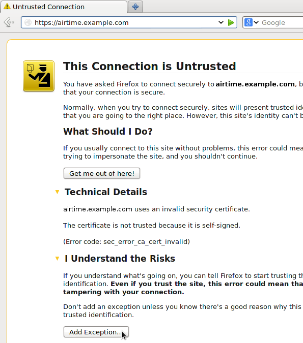

To increase the security of your server, you can enable encrypted access to the LibreTime administration interface, and direct your users towards this more secure login page. The main advantage of using this encryption is that your remote users' login names and passwords are not sent in plain text across the public Internet or untrusted local networks, such as shared Wi-Fi access points.

## Deploying a certificate with Certbot

One of the fastest, easiest, and cheapest ways to get an SSL certificate is through [Certbot](https://certbot.eff.org/), as created by the
[Electronic Frontier Foundation](https://www.eff.org/). There are some requirements for this process:
- you have an HTTP website (already installed and configured by default by the LibreTime installer) and
- this website is open to the public internet (likely via. port forwarding if your computer is behind a firewall) and
- the server is accessible to the public via. port 80

If you aren't able to verify all three requirements, you may want to try a self-signed certificate (see next section).

These instructions come from Certbot's website and assume that you are using an Apache web server
running on Ubuntu 18.04 LTS (the Apache web server is installed with LibreTime by default).
Instructions for other Debian-based OSes are similar, but check with Certbot for clarification.

Note: all instructions require you to have sudo priveledges

First, add Certbot's PPA using:

```
    sudo apt-get update
    sudo apt-get install software-properties-common
    sudo add-apt-repository universe
    sudo add-apt-repository ppa:certbot/certbot
    sudo apt-get update
```

Next, install Certbot and install the SSL certificate using the below commands:

```
sudo apt-get install certbot python3-certbot-apache
sudo certbot --apache  # get and install the certificate
sudo certbot certonly --apache  # to only get the certificate, not install it using Certbot
```

You can test certificate renewal by running `sudo certbot renew --dry-run`.
Head to your server's IP address to check to see that the installation worked.

## Deploying a self-signed certificate

The Debian/Ubuntu package *ssl-cert* creates a *snakeoil* certificate and key based on your server's hostname. This gratis certificate and key pair created under the */etc/ssl/certs*/ and */etc/ssl/private/* directories will not be recognised by users' browsers without manual intervention. You can install the *ssl-cert* package with the command:

    sudo apt-get install ssl-cert

If the hostname of your server does not match the domain name you intend to use with the LibreTime virtual host, the user's browser will present an additional security warning. You can set the domain name of the certificate by editing the file */usr/share/ssl-cert/ssleay.cnf* to replace the *@HostName@* variable:

    commonName                      = @HostName@

with the domain name used by LibreTime:

    commonName                      = airtime.example.com

Then save the file and regenerate the certificate with the command:

    sudo make-ssl-cert generate-default-snakeoil --force-overwrite

You should enable additional Apache modules for page redirections, custom headers and secure access:

    sudo a2enmod alias headers ssl

Next, edit the virtual host configuration for your LibreTime server to include a stanza for the https:// interface on port 443 and a redirect for logins from port 80:

    sudo nano /etc/apache2/sites-available/airtime-vhost.conf

Using the following configuration for Apache 2.2 as a guide, replace *airtime.example.com* with the name of your server and *admin@example.com* with your email address. The older SSLv2 and SSLv3 protocols and SSL compression should be disabled, as they are generally believed to be insecure. You may wish to create a *ServerAlias* for users to access the administration interface over https:// if required.

On port 80, Apache's *alias* module is used to set a *Redirect permanent* for the login page. Optionally, access could be denied to all sites except *localhost* and any other LibreTime servers on your network, so that unencrypted communication between LibreTime components can continue.

```
    <VirtualHost *:443>
          SSLEngine on
          SSLProtocol All -SSLv2 -SSLv3
          SSLCompression off
          SSLCertificateFile /etc/ssl/certs/ssl-cert-snakeoil.pem
          SSLCertificateKeyFile /etc/ssl/private/ssl-cert-snakeoil.key
          Header always set Strict-Transport-Security "max-age=31536000"

          ServerName airtime.example.com
          #ServerAlias www.example.com

          ServerAdmin admin@example.com

          DocumentRoot /usr/share/airtime/php/airtime_mvc/public
          DirectoryIndex index.php

          <Directory /usr/share/airtime/php/airtime_mvc/public>
                  Options -Indexes FollowSymLinks MultiViews
                  AllowOverride all
                  Order allow,deny
                  Allow from all
          </Directory>
    </VirtualHost>

    <VirtualHost *:80>
          ServerName airtime.example.com

          ServerAdmin admin@example.com

          DocumentRoot /usr/share/airtime/php/airtime_mvc/public
          Redirect permanent /login https://airtime.example.com/login

          SetEnv APPLICATION_ENV "production"

          <Directory /usr/share/airtime/php/airtime_mvc/public>
                  Options -Indexes FollowSymLinks MultiViews
                  AllowOverride All
                  Order allow,deny
                  Allow from all
          </Directory>
    </VirtualHost> 
```

Save the file with **Ctrl+O** and exit the **nano** editor with **Ctrl+X**. Then restart Apache with the command:

    sudo service apache restart

When attempting to log into your server via http:// in future, you should be redirected to https:// automatically.

### Importing a self-signed certificate into the browser

The first time you access an LibreTime server with a self-signed certificate over https:// your browser will block the login page and display a security warning. In **Mozilla Firefox**, you can click **Technical Details** to confirm that the warning is due to the certificate being self-signed before clicking the **Add Exception** button. In **Google Chrome**, the button to click on the security warning page is **Proceed Anyway**.



On the next page in Firefox, click the **Get Certificate** button to inspect the details of the self-signed certificate. If all is well, click the **Confirm Security Exception** button. You should now be able to proceed to the https:// login page.  


If the users of your LibreTime server wish to avoid going through these steps, or they do not trust the remote LibreTime server to be what it claims to be, it is also possible to import a trusted local copy of a certificate file into the browser. For example, in Firefox version 30 preferences, you can go into the **Advanced** section, click the **Certificates** tab, then click the **View Certificates** button. On the **Servers** tab of the **Certificate Manager**, there is an **Import** button which enables you to load a certificate file from the local computer.

## Mixed encrypted and unencrypted content

Whether your certificate is self-signed or not, you will see browser security warnings whenever a https:// page is delivering unencrypted content, such as the stream from an Icecast server. In Firefox, an exclamation mark icon is displayed in the address bar of the **Listen** pop-up.

